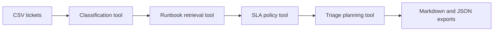

# OpsWise Ticket Agent

OpsWise Ticket Agent is a helpdesk automation agent for entry-level IT and infrastructure teams. It ingests raw support tickets, classifies the issue, retrieves a matching runbook, assigns an SLA target, and exports a triage report.

The MVP is intentionally CLI-first so it can run as a local batch job, GitHub Actions scheduled workflow, or future FastAPI service.

## Demo

Screenshot placeholders:

- `docs/screenshots/cli-run.png` - batch triage command.
- `docs/screenshots/report.png` - generated Markdown report.
- `docs/screenshots/json-output.png` - machine-readable triage output.

Run the sample:

```bash
python -m venv .venv
source .venv/bin/activate
pip install -e ".[dev]"
python -m opswise triage --tickets sample_data/tickets.csv --runbooks runbooks --out outputs/triage-report.md --json-out outputs/triage-report.json
```

## Architecture



## What Makes It Agentic

The agent runs a multi-step workflow:

1. Normalize ticket text.
2. Classify category and severity with confidence.
3. Retrieve the best runbook for the category and keywords.
4. Apply an SLA policy.
5. Produce next actions and escalation criteria.
6. Export both human-readable and machine-readable reports.

The current model is deterministic and testable. A future version can replace the classifier or planner with an LLM while keeping the same tool boundaries.

## Ticket CSV Schema

```csv
id,submitted_at,requester,subject,description,affected_asset,priority
```

## Local Setup

```bash
cp .env.example .env
python -m venv .venv
source .venv/bin/activate
pip install -e ".[dev]"
pytest
python -m opswise triage --tickets sample_data/tickets.csv --runbooks runbooks --out outputs/report.md
```

## Docker

```bash
docker build -t opswise-ticket-agent .
docker run --rm -v "$PWD/outputs:/app/outputs" opswise-ticket-agent
```

## Deployment Ideas

- Scheduled GitHub Action that triages a CSV export daily.
- Containerized cron job on a small VM.
- Future FastAPI service with Jira, GitHub Issues, or Slack integrations.

## CI Template

The GitHub Actions workflow template is included at `docs/github-actions/ci.yml`. Move it to `.github/workflows/ci.yml` after authenticating GitHub CLI with the `workflow` scope.

## Recruiter Notes

This repo shows Python automation, infrastructure thinking, clean module boundaries, CLI design, sample data, tests, CI, Docker, and an applied IT support workflow.
